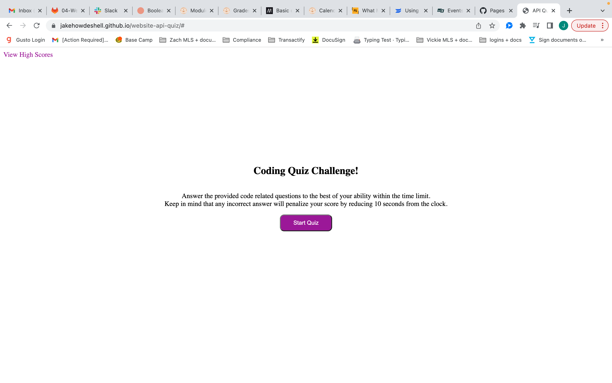
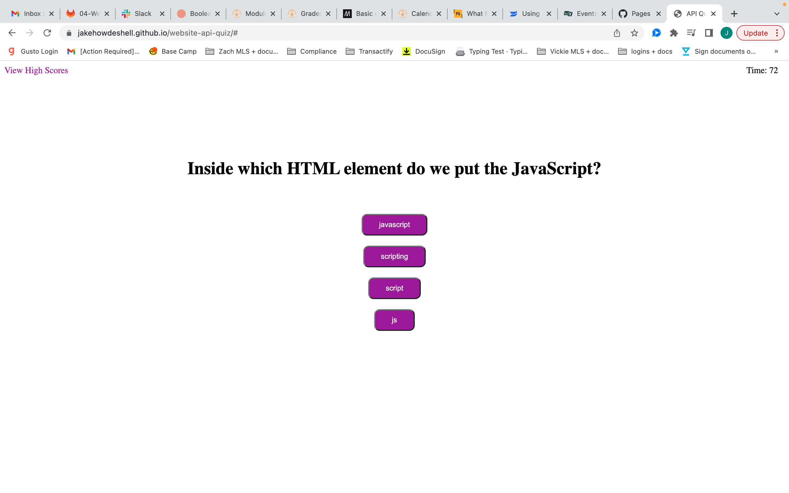
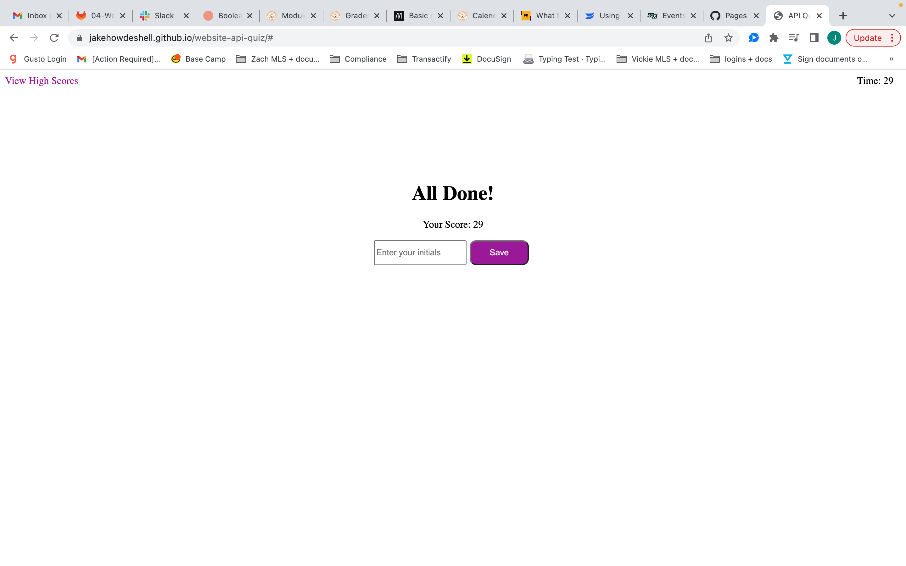
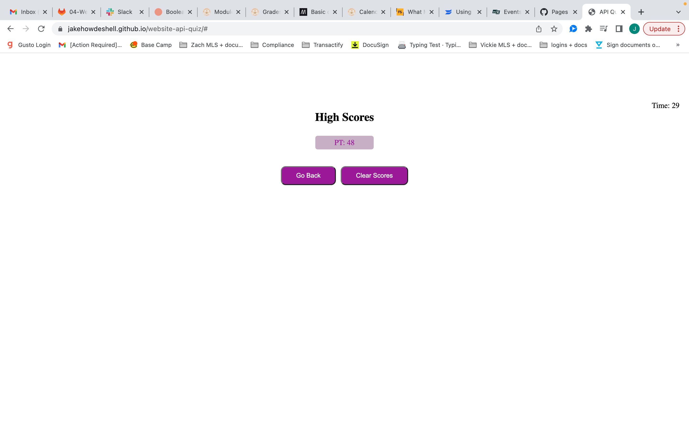

## Project Title

Web API JavaScript Quiz

## Project Description

AS A coding boot camp student
I WANT to take a timed quiz on JavaScript fundamentals that stores high scores
SO THAT I can gauge my progress compared to my peers
GIVEN I am taking a code quiz

WHEN I click the start button
THEN a timer starts and I am presented with a question

Using HTML a start button was created then using Javascript three seperate functions were created, one that referenced the id connected to the start button eleminating the contents of that Id. Then call in the other two functions to begin, one initiating a timer and the other displaying a question with multiple choices on the page.

WHEN I answer a question
THEN I am presented with another question

The question function utilized an array of objects to pull from and ran through that array using a for loop to navigate to the next index of that array.

WHEN I answer a question incorrectly
THEN time is subtracted from the clock

A checkAnswer function compared the array index of the button selected to the array index of the answer provided in the object array. If those indexes were not equal ten seconds would be subtracted from the timeLeft and "wrong!" would be displayed underneath the questions for one second.

WHEN all questions are answered or the timer reaches 0
THEN the game is over

Whithin the timer function there is a call to the endQuiz function when the timeLeft is lessthan or equal to zero. The checkAnswer function also calls the endQuiz function if the current question index is no longer less than the length of the question object array index.

WHEN the game is over
THEN I can save my initials and score

The saveScore function stores both the initials and score to a object variable and then pushes that into a global array and adds it to local storage as a string.

## Screenshots

## Deployed Webpage

https://jakehowdeshell.github.io/website-api-quiz/#
